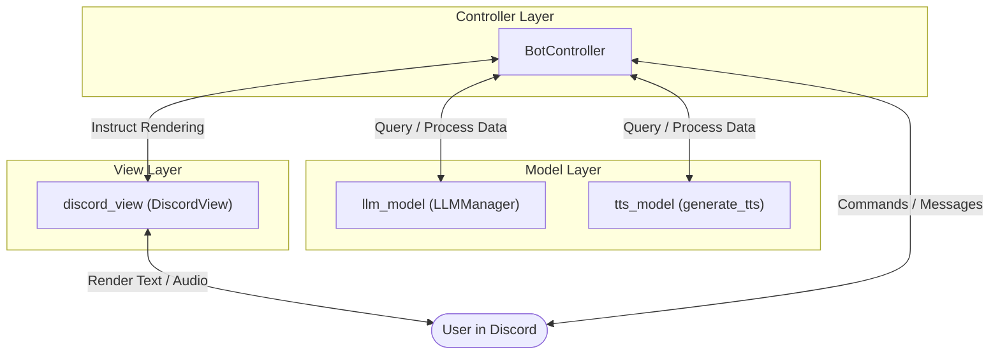
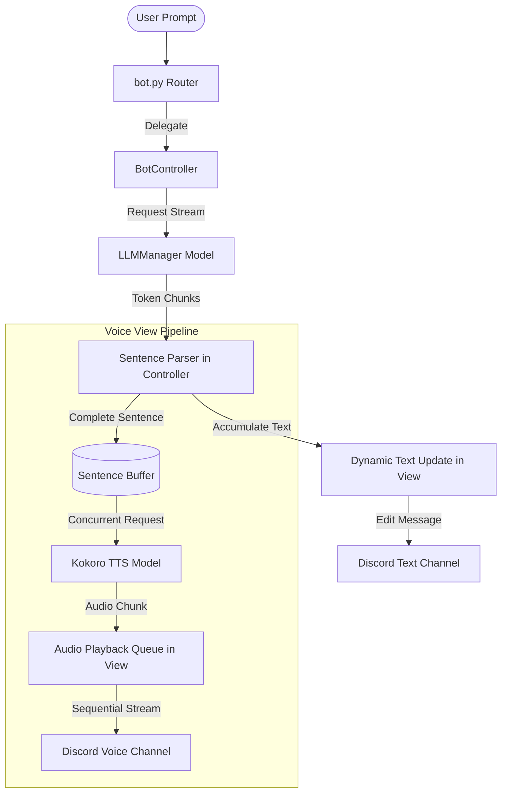
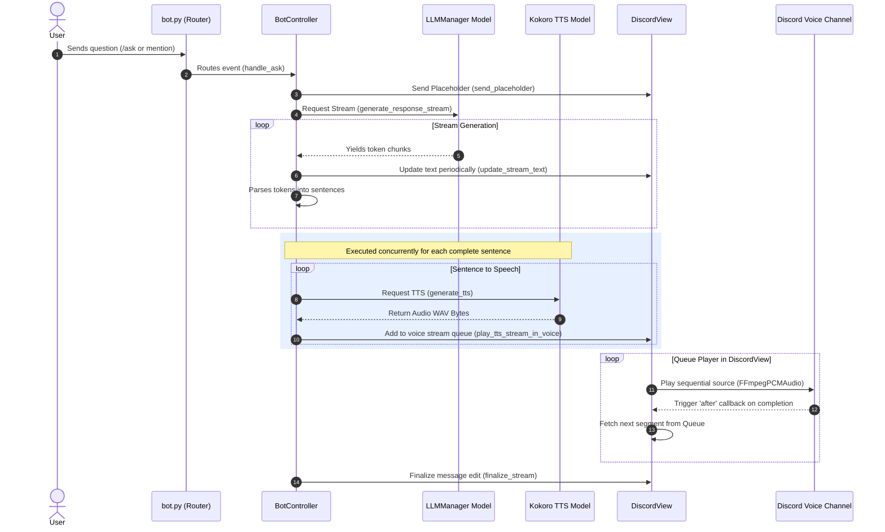

# Nullpointer Bot

Nullpointer is a multi-LLM and Text-to-Speech (TTS) Discord bot. It supports interacting with various language models (Gemini, OpenAI, Ollama) and includes text-to-speech capabilities via a local Kokoro TTS service.

## Features

- **Multi-LLM Support**: Configurable per-channel LLM provider.
  - **Gemini**: Powered by Google's Gemini 2.5 Flash Lite (default).
  - **OpenAI**: Support for OpenAI models (e.g., GPT-4o-mini).
  - **Ollama**: Connects to a local Ollama instance (defaulting to Qwen 2.5 Coder 7B).
- **Text-to-Speech (TTS)**: Integration with local Kokoro TTS.
  - Generates speech audio and plays it directly in Discord voice channels or sends it as `.wav` attachments.
  - Supports multiple voices (US/UK, male/female).
- **Image Analysis**: Attachment support for multimodal inputs.
- **Dockerized**: Easy containerization and deployment.

## Commands

### Prefix Commands
- `!ask [question]`: Ask the LLM a question (remembers context, attach images to analyze). **Automatically joins and speaks the answer if you are in a voice channel.**
- `!speak [voice] [text]`: Speak text in a voice channel or generate a WAV file.
- `!leave`: Disconnect the bot from the voice channel.
- `!clear`: Clear conversation history for the current channel.
- `!provider [name]`: View or set the current channel's LLM provider.
- `!model [name]`: View or set the model for the current channel.

### Slash Commands
- `/ask [question] [attachment]`: Interactive command to ask questions. **Automatically joins and speaks the answer if you are in a voice channel.**
- `/speak [text] [voice] [speed]`: Generate voice audio with custom options.
- `/leave`: Disconnect the bot from the voice channel (also supports typing `/leave` as a plain text chat message).
- `/clear`: Clear conversation history.
- `/provider [name]`: Set the LLM provider.
- `/model [model_name]`: Set the model.

## Setup and Run

1. Clone this repository.
2. Configure `.env` with your Discord token and API keys:
   ```env
   DISCORD_TOKEN=your_discord_token
   GEMINI_API_KEY=your_gemini_api_key
   OPENAI_API_KEY=your_openai_api_key
   OLLAMA_HOST=http://localhost:11434
   OLLAMA_MODEL=qwen2.5-coder:7b
   TTS_URL=http://localhost:8998/tts
   ```
3. Run locally using Python:
   ```bash
   pip install -r requirements.txt
   python bot.py
   ```

## Docker

Build and run the Docker image:
```bash
docker build -t nullpointer-bot .
docker run --env-file .env nullpointer-bot
```

---

## System Design & Architecture

Nullpointer Bot is designed using the **Model-View-Controller (MVC)** architectural pattern to cleanly separate the concerns of data representation, presentation logic, and application control flow:



### MVC Roles & File Structure

1. **Model** (`src/models/`): Encapsulates data structure, API client configurations, and core business operations:
   - [llm_model.py](file:///home/krishnakanth/deployed/nullpointer-bot/src/models/llm_model.py): Manages conversation histories (`conversation_histories`), provider selections, and client generators for Gemini, OpenAI, and Ollama APIs.
   - [tts_model.py](file:///home/krishnakanth/deployed/nullpointer-bot/src/models/tts_model.py): Handles calling the local Kokoro TTS endpoints to synthesize WAV audio bytes.

2. **View** (`src/views/`): Encapsulates presentation formatting and output rendering to Discord:
   - [discord_view.py](file:///home/krishnakanth/deployed/nullpointer-bot/src/views/discord_view.py): Handles interaction response formats, placeholder states, text message splits (to comply with Discord's 2000 character limits), rate-limited periodic message edits, and streaming FFmpeg audio playback in Discord voice channels.

3. **Controller** (`src/controllers/`): Orchestrates execution flows, hooks event loops, and links Models with Views:
   - [bot_controller.py](file:///home/krishnakanth/deployed/nullpointer-bot/src/controllers/bot_controller.py): Implements message parsers, schedules concurrent stream tasks (e.g. streaming chunks from LLM while simultaneously processing sentences and calling TTS), and exposes entry hooks for prefix/slash commands.

4. **Entrypoint Router** (`bot.py`):
   - [bot.py](file:///home/krishnakanth/deployed/nullpointer-bot/bot.py): Bootstraps the Discord bot, configures intents, registers prefix and slash commands, and delegates execution directly to the `BotController`.

---

### Real-Time Streaming Architecture

This is the primary pipeline used for `/ask`, `!ask`, and bot mentions. The bot streams chunks from the LLM, accumulates them into sentences in real time, requests audio from the Kokoro TTS service concurrently, and queues them to a sequential audio playback sink in the Discord voice channel.



#### Detailed Sequence Flow (Streaming)



---

### Python Streaming Implementation Details
The real-time streaming pipeline is implemented as follows:
1. **LLM Client Streaming**: Calls `generate_response_stream()` to yield chunks from the LLM provider (Gemini, OpenAI, or Ollama HTTP stream) using asynchronous generator iterators.
2. **Regex Sentence Splitting**: Employs a regex lookbehind matcher (`(?<!\bMr)(?<!\bDr)(?<=[.!?])\s+`) to extract complete sentences from the raw token buffer inside the controller.
3. **Async HTTP Queue**: Fetches TTS audio segments concurrently as sentences complete and queues them to a thread-safe `asyncio.Queue` managed by `DiscordView`.
4. **Discord Audio Playback Sink**: Uses a background `_playback_worker` task inside `DiscordView` that monitors queue elements and triggers sequential voice client playback (`voice_client.play`) inside the async event loop using `loop.call_soon_threadsafe(playing_done.set)` inside discord.py's internal voice thread callback.

